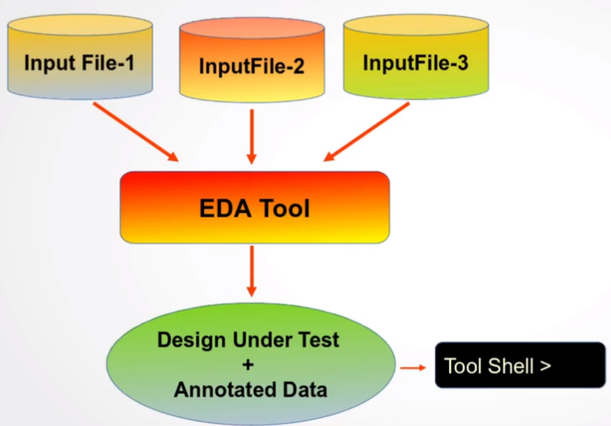

# Introduction

TCL or Tool Command Language is a an open-source multi-purpose interpreted powerful dynamic scripting language. It is widely used in various domains in VLSI Design and Verification.

### Domains of TCL

1. Front-end synthesis tool. Every front-end tools has a tcl shell available
2. Back-end placement and route Tool (PnR)
3. Static Timing Analysis Tool (STA)
4. Design for Testability Tool (DFT)
5. And more

> *Why using TCL instead of Bash or other scripting tools?*
> 

TCL script can integrate with major EDA tools with interactive shell of it own. 

It is cross-platform and has data structures built-in such as lists, arrays and dictionaries. TCL has also control structures. TCL has also regular expression (RegEx engine) that is robust as PERL, python etc..

### TCL script and DUT

A VLSI design has a very large number of input files that are read by the EDA tool.After the compilation, the design comes to life inside the tool, and a shell is made available to the designer to *communicate* with the design.

{width=50}

You can source your tcl script into the tool shell, in which the tool’s API are used. Indeed, application programming interfaces are used for a better interaction between the tool and user written tcl code.

```bash
#!/usr/bin/tclsh

puts "hello world";
```
